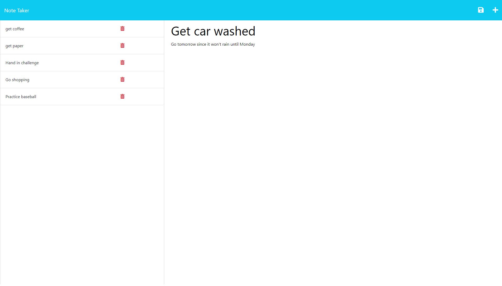

# Note-taker-app

## Description
I created the note taker application and deployed it on Heroku so there would be a simple and easy way to create notes or a todo list that you can see on the left-hand side of the page. Once you type the notes a save icon will appear and you can save the note. This is a great way to have a list of items or tasks that need to be accomplished. It saves you from compiling a bunch of sticky notes around your desk or on the fridge. I learned through this application how to put into practice of connecting the back end of an application with the front end of an application. 

## Installation
In order to begin once the application loads click on the get started button. This will take you to the page to be able to type in a note title and note text.

## Usage 
As you begin to type your note title and note text you will see a save icon appear. Once you finish writing the note, click on the save icon and you will see that note saved to the left-side of the screen. If you need to look at it again just click on it and it will appear in full on the right-side of the screen again to view. Click on the plus sign in the top right to add another note. 

Here is the website link: https://protected-dusk-26151.herokuapp.com/

Here is a screenshot 

## Credits
N/A

## License
N/A 

